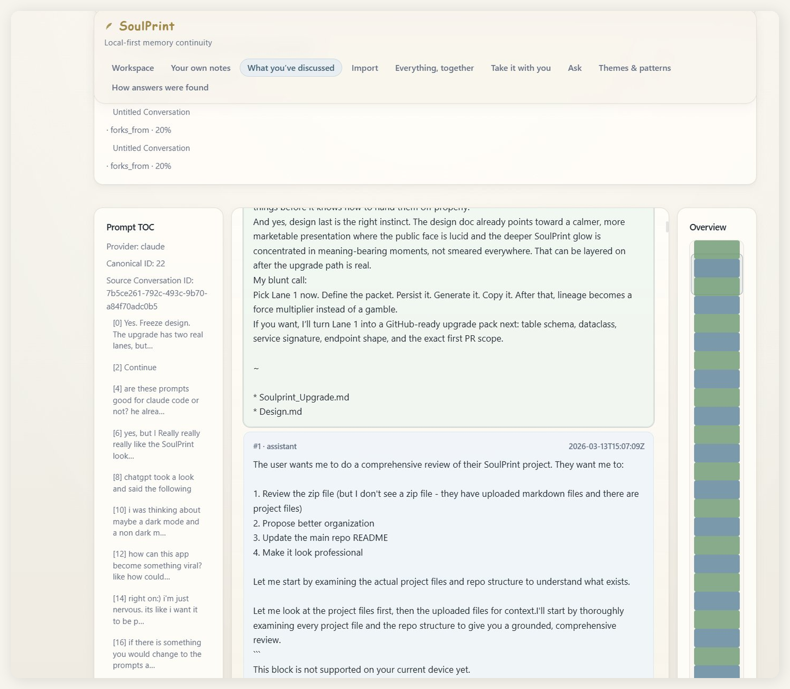
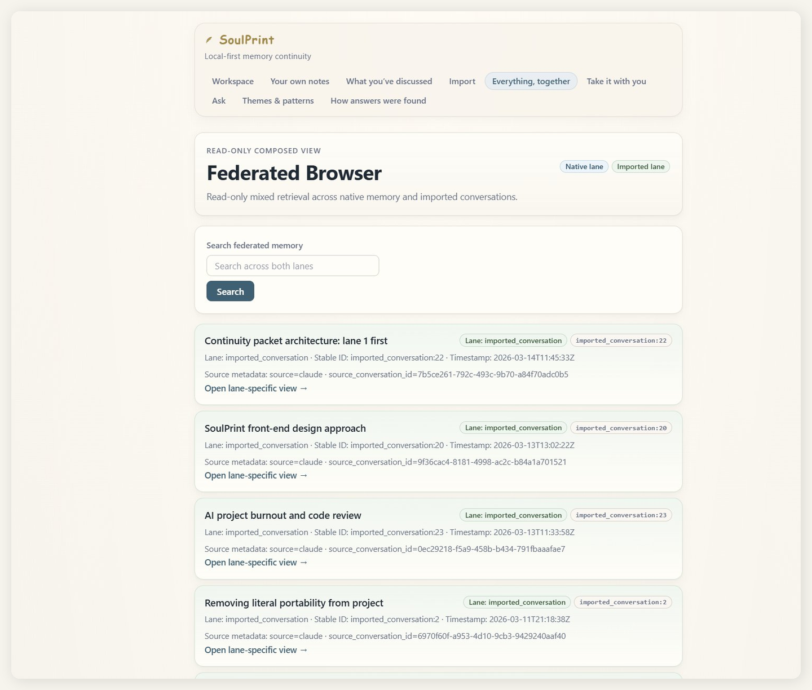
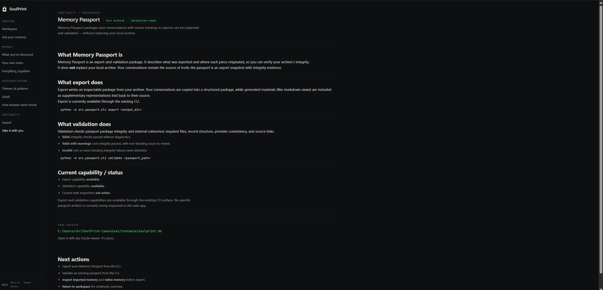

# SoulPrint

[](https://github.com/Celestialchris/SoulPrint-Canonical/actions/workflows/tests.yml)
[](https://www.python.org/downloads/)
[](LICENSE)

**Your AI conversations are scattered everywhere. SoulPrint brings them home.**

A local-first memory continuity system. Import your AI conversation history from ChatGPT, Claude, and Gemini. Browse, search, discover themes, ask questions, and export a verifiable Memory Passport. Everything stays on your machine. Nothing is hosted. The canonical ledger is yours.

---

## What SoulPrint Does

**Import** — Drop your ChatGPT `.zip`, Claude `.json`, or Gemini Takeout. Auto-detected. Normalized into one canonical ledger.

**Browse** — Workspace, imported conversations, native notes, federated view across all providers. Every record carries stable IDs, timestamps, and provenance.

**Search** — Full-text across all conversations, all providers. Lane-aware retrieval (imported, native, federated).

**Ask** — Grounded answering from your own conversation record. Every answer cites specific conversations. Every answer has an auditable trace.

**Discover** — Cross-conversation topic detection. Per-conversation summaries. Multi-conversation digests. All derived, all traceable.

**Continue** — Generate compact continuity packets from any conversation. Copy a structured handoff into your next chat so you never start from zero.

**Export** — Memory Passport with checksums and provenance. Verifiable against the canonical record.

---

## Screenshots

**Workspace** — your continuity dashboard with provider coverage and recent activity


**Transcript Explorer** — prompt-level navigation with TOC and minimap


**Federated Browser** — cross-provider view with explicit provenance


**Memory Passport** — export and validate your canonical archive


## What SoulPrint Is Not

- **Not a hosted SaaS** — your data never leaves your machine
- **Not a mem0 clone** — SoulPrint is for users, not developer infrastructure
- **Not an AI dashboard** — no metrics theater, no admin-panel energy
- **Not a generic wrapper** — SoulPrint has its own canonical ledger and trust chain

## Quick Start

```bash
git clone https://github.com/Celestialchris/SoulPrint-Canonical.git
cd SoulPrint-Canonical

pip install -r requirements-minimal.txt
pip install -e .

soulprint
# Opens http://127.0.0.1:5678
```

Drop an export file on the Import page. Your conversations appear in seconds.

## Why I Built This

I've been using ChatGPT, Claude, and Gemini daily for over a year. My conversation history — ideas, decisions, research threads, creative work — is scattered across three platforms that don't talk to each other. Their exports are barely usable zip files that sit dead on disk.

Nobody was building a tool to bring all of that together locally, with provenance, intelligence, and real exportability. So I built one.

SoulPrint is not a hosted service that wants to hold your data. It's a local tool that treats your AI memory the way it should be treated: as yours.

## Intelligence (BYOK)

SoulPrint's intelligence features use your own API key. Configure once:

```bash
export SOULPRINT_LLM_PROVIDER=openai      # or: anthropic
export SOULPRINT_LLM_API_KEY=sk-...
```

Without a key, import, browse, search, and export all work fully. Intelligence features (summaries, topics, digests, ask, continuity packets) require a configured provider.

## Providers

| Provider | Format | Status |
|----------|--------|--------|
| ChatGPT | `.zip` export from OpenAI | ✓ Supported |
| Claude | `.json` export from Anthropic | ✓ Supported |
| Gemini | Google Takeout | ✓ Supported |

Adding a provider is bounded work: adapter, detector, registry entry, fixture, tests. The architecture supports unlimited providers.

## Surfaces

| Route | Purpose |
|-------|---------|
| `/` | Workspace — ledger overview and activity |
| `/import` | Import conversations from any supported provider |
| `/ask` | Ask questions answered from your conversation record |
| `/intelligence` | Summaries, topic scans, and digests |
| `/imported` | Browse imported conversations by provider |
| `/imported/<id>/explorer` | Transcript explorer with prompt-level navigation |
| `/federated` | Cross-provider view with provenance |
| `/chats` | Native memory — notes created directly in SoulPrint |
| `/passport` | Export and validate your Memory Passport |
| `/answer-traces` | Audit trail for every generated answer |

## Architecture

```
Layer A — Truth         Canonical SQLite ledger. Explicit lanes. Stable provenance.
Layer B — Legibility    Browse, search, inspect, trace, export. Read-only over truth.
Layer C — Intelligence  Summaries, topics, digests, continuity. All derived. All traceable.
Layer D — Distribution  Desktop app, landing page, freemium gate.
```

Every derived artifact stores: source conversation IDs, generation timestamp, LLM provider, and prompt template version. Derived never impersonates canonical.

## Repo Map

```
src/
├── app/            Flask web app, templates, static assets
├── importers/      Provider adapters, auto-detection, persistence
├── retrieval/      Federated retrieval across storage lanes
├── answering/      Grounded answering and trace audit
├── intelligence/   Summaries, topics, digests, continuity engine
├── passport/       Memory Passport export and validation
└── tools/          CLI utilities

tests/              41 test files
sample_data/        Synthetic provider fixtures
docs/               Architecture, specs, product docs
landing/            Static landing page
```

## Packaging

### Windows executable

Build a standalone Windows executable from the repo:

```powershell
cmd /c "scripts\build_windows.bat"
```

This runs the test suite, then packages the app with PyInstaller.
Output lands in `dist\SoulPrint\`:

```
dist/
├── SoulPrint/
│   ├── SoulPrint.exe    ← double-click to launch
│   └── _internal/
└── SoulPrint-windows.zip
```

The exe starts the local server and opens your browser to
`http://127.0.0.1:5678` automatically.

For the full packaging overview, see
[`docs/executable-packaging-overview.md`](docs/executable-packaging-overview.md).

---

## Tests

```bash
pytest
```

41 test files covering parsing, persistence, retrieval, intelligence, continuity, passport, CLI, and browser integration.

## CLI Tools

```bash
# Import conversations
python -m src.importers.cli sample_data/chatgpt_export_sample.json --db instance/soulprint.db

# Federated search
python -m src.retrieval.cli --db instance/soulprint.db "search term"

# Grounded answering
python -m src.answering.cli --db instance/soulprint.db "What do I have about Lisbon?"

# Export Memory Passport
python -m src.passport.cli exports/passports --db instance/soulprint.db

# Validate a passport
python -m src.passport.cli validate exports/passports/memory-passport-v1
```

## Project Status

| Component | State |
|-----------|-------|
| Canonical ledger | ✓ Stable |
| 3-provider import | ✓ Stable |
| 10 web surfaces | ✓ Stable |
| Intelligence layer | ✓ Stable |
| Continuity engine | ✓ Stable |
| Memory Passport | ✓ Stable |
| Grounded answering + traces | ✓ Stable |
| Bridge assembly | ✓ Stable |
| Lineage suggestions | ✓ Stable |
| Desktop wrapper | Planned |
| Freemium gate | Planned |

## Roadmap

See [`ROADMAP.md`](ROADMAP.md) for the sequenced build plan and [`DECISIONS.md`](DECISIONS.md) for frozen architectural decisions.

## Docs

- [Getting started](docs/getting-started.md)
- [Product positioning](docs/product/positioning.md)
- [Memory Passport spec](docs/specs/memory-passport-spec.md)
- [Answering boundary](docs/architecture/answering-boundary.md)
- [Brand guide](docs/product/brand.md)
- [Visual direction](docs/product/visual-direction.md)

## Contributing

See [`CONTRIBUTING.md`](CONTRIBUTING.md). The short version: small PRs, tests required, no speculative architecture.

## License

Apache-2.0 — [inspect the code yourself](LICENSE).

---

*Built with local-first principles. Your memory, under your custody.*
